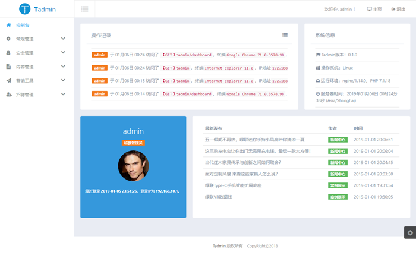

<h1 align="center">
  Tadmin
</h1>

<p align="center">
  <strong>一个基于 ThinkPH P的一款非侵入式后台开发框架！</strong>
</p>

<p align="center"> 
   <a href="https://packagist.org/packages/leeqvip/tadmin">
      
  </a>   
  <a href="https://packagist.org/packages/leeqvip/tadmin">
      
  </a>   
  <a href="https://packagist.org/packages/leeqvip/tadmin">
    
  </a>
</p>

<p align="center">
  <a href="http://tadmin.tech1024.com/" target="_blank">
    
  </a>
</p>

## 安装

最方便的安装方式就是使用Composer ( https://getcomposer.org/ )，在这之前**务必**先搭建好thinkphp项目

1、安装Tadmin

```
composer require leeqvip/tadmin
```

2、注册服务

注册服务，在应用的全局公共文件`service.php`中加入：

```php
return [
    // ...

    tadmin\TadminService::class,
];
```

3、执行初始化和数据库迁移：

**确保数据库配置信息正确**）

```
php think tadmin:init
php think tadmin:migrate:run
```

## 进入tadmin后台

打开后台地址，例如：

http://yourdomain/tadmin

## 演示地址

**后台**：
http://tadmin.tech1024.com/tadmin

用户名：admin 密码：abc-123

**前台**：
http://tadmin.tech1024.com

## 协议

`Tadmin` 采用 [MIT](LICENSE) 开源协议发布。

## 联系

有问题或者功能建议，请联系我们或者提交PR:
- https://github.com/leeqvip/tadmin/issues
- leeqvip@gmail.com
